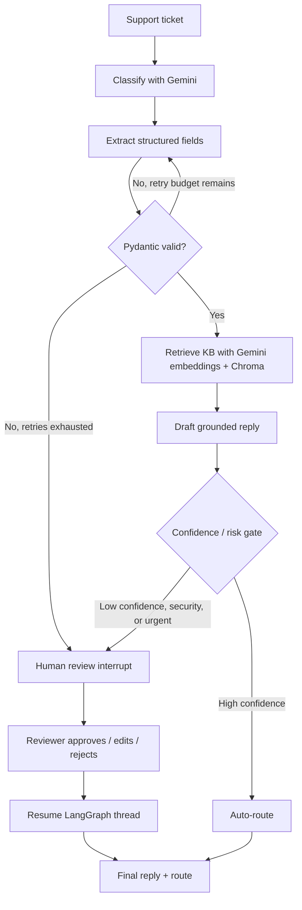

# AI Support Ticket Triage & Resolution System

A portfolio-grade Python AI engineering project that classifies support tickets, extracts structured fields, retrieves relevant knowledge-base articles, drafts grounded replies, and either routes tickets automatically or pauses for human approval.

**Stack:** Gemini 3.8 Flash · Gemini Embeddings · LangGraph · Pydantic · Chroma · FastAPI · Streamlit · Langfuse · Docker

## What this project demonstrates

- **LLM orchestration:** LangGraph state machine with real branching and retry loops.
- **Reliable structured output:** Gemini structured output validated by Pydantic.
- **RAG:** Gemini embeddings + Chroma semantic retrieval over local knowledge-base articles.
- **Human-in-the-loop:** low-confidence, urgent, and security tickets pause with a LangGraph interrupt and resume after reviewer input.
- **Evaluation:** classification accuracy, priority accuracy, and retrieval hit@3 on a labeled synthetic dataset.
- **Observability:** optional Langfuse v4 tracing.
- **Shipping:** FastAPI, Streamlit, Docker, tests, and GitHub Actions CI.


## Architecture



### Why LangGraph instead of a simple function chain?

The workflow has behavior that benefits from explicit graph semantics: conditional routing, an extraction retry loop, persistent state, and a true human-in-the-loop pause/resume boundary. A straight sequence of functions would work for the happy path, but it would make retries, checkpointing, and reviewer resumption more ad hoc. LangGraph makes those control-flow decisions visible, testable, and easier to evolve.

## Repository structure

```text
ai-ticket-triage/
├── app/
│   ├── api.py                 # FastAPI service
│   ├── cli.py                 # Command-line demo
│   ├── config.py              # Environment configuration
│   ├── graph.py               # LangGraph workflow
│   ├── llm.py                 # Gemini + embedding client
│   ├── policy.py              # Confidence/risk routing policy
│   ├── retriever.py           # Chroma knowledge-base retrieval
│   ├── schemas.py             # Pydantic schemas
│   ├── service.py             # Start/resume workflow service
│   ├── state.py               # Typed LangGraph state
│   ├── tracing.py             # Optional Langfuse tracing
│   ├── nodes/
│   │   ├── classify.py
│   │   ├── extract.py
│   │   ├── retrieve.py
│   │   ├── draft.py
│   │   ├── review.py
│   │   └── route.py
│   └── kb/                    # Sample support knowledge base
├── data/tickets_labeled.json  # Eval dataset
├── evals/run_evals.py
├── tests/
├── ui/streamlit_app.py
├── .github/workflows/ci.yml
├── Dockerfile
├── docker-compose.yml
└── requirements.txt
```

## 1. Prerequisites

Use **Python 3.12** for the smoothest match between local development, CI, Docker, and Streamlit deployment.

You also need a Gemini API key from Google AI Studio:

https://aistudio.google.com/apikey

Do **not** commit the key to GitHub.

## 2. Local setup

### Windows PowerShell

```powershell
git clone <YOUR_REPOSITORY_URL>
cd ai-ticket-triage

py -3.12 -m venv .venv
.\.venv\Scripts\Activate.ps1

python -m pip install --upgrade pip
pip install -r requirements.txt

Copy-Item .env.example .env
```

Open `.env` and replace:

```env
GEMINI_API_KEY=your_gemini_api_key_here
```

### macOS / Linux

```bash
git clone <YOUR_REPOSITORY_URL>
cd ai-ticket-triage

python3.12 -m venv .venv
source .venv/bin/activate

python -m pip install --upgrade pip
pip install -r requirements.txt

cp .env.example .env
```

Then add your key to `.env`.

## 3. Run the Streamlit portfolio demo

```bash
streamlit run ui/streamlit_app.py
```

Open the local URL Streamlit prints in the terminal.

Good demo tickets:

**Auto-route example**

```text
Subject: Charged twice for September
Body: Invoice INV-8831 appears twice on my card statement. Please refund the duplicate charge.
```

**Human-review example**

```text
Subject: Unknown login to admin account
Body: We see an unfamiliar sign-in to our admin account and believe an API key may be exposed. What should we do now?
```

Security and urgent tickets are intentionally forced into human review even with high model confidence.

## 4. Run the FastAPI service

```bash
uvicorn app.api:app --reload
```

Then open:

```text
http://127.0.0.1:8000/docs
```

The interactive Swagger page lets you test the API without writing a frontend.

### Triage endpoint

`POST /triage`

Example body:

```json
{
  "subject": "API returns 500",
  "body": "POST /v1/jobs has returned HTTP 500 for every request since 09:20 UTC. Production is blocked.",
  "customer_email": "alex@example.com"
}
```

If the response has `status: "review_required"`, keep the returned `thread_id` and call:

`POST /review/{thread_id}`

Example approval:

```json
{
  "approved": true,
  "edited_reply": "Thanks for reporting this. We have the failure details and are routing this to Engineering for investigation.",
  "route_to": "engineering",
  "note": "Reviewed before routing."
}
```

## 5. Run tests

The tests do not require a Gemini API key.

```bash
pytest -q
```

You can also do a syntax/compile check:

```bash
python -m compileall app ui evals tests
```

## 6. Run evaluations

The evaluation script **does** call Gemini and therefore requires `GEMINI_API_KEY`.

```bash
python evals/run_evals.py
```

It writes:

- `evals/results.json` — per-example predictions and retrieval results.
- `evals/results.md` — summary table and misclassification notes.

Metrics included:

- classification accuracy
- priority accuracy
- retrieval hit@3

This is intentionally a small synthetic portfolio dataset, not a claim of production accuracy. Add real anonymized support data before drawing production conclusions.

## 7. Optional Langfuse tracing

Create a Langfuse project and add these values to `.env`:

```env
ENABLE_LANGFUSE=true
LANGFUSE_CAPTURE_CONTENT=false
LANGFUSE_PUBLIC_KEY=pk-lf-...
LANGFUSE_SECRET_KEY=sk-lf-...
LANGFUSE_BASE_URL=https://cloud.langfuse.com
```

The Gemini structured-generation calls will then appear as observations. By default, prompt/output content is not sent to Langfuse (`LANGFUSE_CAPTURE_CONTENT=false`) to reduce accidental PII exposure; enable content capture only with data you are allowed to trace. Tracing is deliberately non-blocking: if observability fails, the ticket workflow should still run.

## 8. Docker

Build the FastAPI image:

```bash
docker build -t ai-ticket-triage .
```

Run it with your local `.env`:

```bash
docker run --rm -p 8000:8000 --env-file .env ai-ticket-triage
```

Or use Compose with persistent Chroma and LangGraph state volumes:

```bash
docker compose up --build
```

Then open `http://localhost:8000/docs`.

## 9. Deploy the Streamlit demo

For a recruiter-facing portfolio demo, Streamlit Community Cloud is the simplest option.

1. Push this project to a GitHub repository.
2. Sign in to Streamlit Community Cloud with GitHub.
3. Create a new app from your existing repository.
4. Choose your repository and `main` branch.
5. Set the entrypoint to:

   ```text
   ui/streamlit_app.py
   ```

6. In Advanced settings choose Python 3.12.
7. In **Secrets**, add:

   ```toml
   GEMINI_API_KEY = "your-real-key"
   ```

   Optional Langfuse values can be added there too.

8. Deploy.

Never add `.streamlit/secrets.toml` or `.env` to Git. Both are already ignored by this repo.

### Note about demo persistence

Streamlit Community Cloud may replace/restart the app environment. Chroma can rebuild its small demo index from `app/kb/`, but local SQLite checkpoints should not be treated as durable production storage. For a real production service, move LangGraph checkpoints to Postgres and the vector store to a hosted service such as Qdrant, pgvector, or Chroma Cloud.

## 10. Deploy the FastAPI service

The included `Dockerfile` can be used on container platforms such as Render or Railway.

General deployment settings:

- Build from the repository `Dockerfile`.
- Expose port `8000` or let the platform map its `PORT` value.
- Add `GEMINI_API_KEY` as a secret environment variable.
- Keep `LANGGRAPH_STRICT_MSGPACK=true`.
- For durable production human-review state, use a persistent database-backed LangGraph checkpointer instead of local SQLite.

If the platform expects a start command rather than the Docker `CMD`, use:

```bash
uvicorn app.api:app --host 0.0.0.0 --port $PORT
```

## 11. Put the project on GitHub

### New empty repository

Create an empty GitHub repo, then from this project folder run:

```bash
git init
git add .
git commit -m "Build AI support ticket triage system"
git branch -M main
git remote add origin https://github.com/YOUR_USERNAME/YOUR_REPO.git
git push -u origin main
```

### Existing repository

Copy this project into the existing repository folder, then run:

```bash
git status
git add .
git commit -m "Add Gemini LangGraph ticket triage project"
git push
```

Before pushing, verify this command does **not** show `.env` or `secrets.toml`:

```bash
git status
```

## 12. Configuration

| Variable | Default | Purpose |
|---|---|---|
| `GEMINI_API_KEY` | required | Gemini authentication |
| `GEMINI_MODEL` | `gemini-3.8-flash` | classification/extraction/drafting model |
| `GEMINI_EMBEDDING_MODEL` | `gemini-embedding-001` | vector embeddings |
| `CONFIDENCE_THRESHOLD` | `0.78` | below this, require human review |
| `MAX_EXTRACT_RETRIES` | `2` | Pydantic extraction retry budget |
| `KB_TOP_K` | `3` | retrieved KB documents |
| `CHROMA_DIR` | `.chroma` | local Chroma persistence |
| `CHECKPOINT_DB` | `.langgraph_checkpoints.sqlite` | LangGraph SQLite state |
| `ENABLE_LANGFUSE` | `false` | enable optional tracing |
| `LANGFUSE_CAPTURE_CONTENT` | `false` | opt in to prompt/output content in traces |

## 13. Production hardening ideas

For a real production version, the most important upgrades are:

- Postgres checkpointer for durable LangGraph interrupts.
- Hosted pgvector/Qdrant/Chroma instead of local embedded Chroma.
- Authentication/authorization around the reviewer and API endpoints.
- PII redaction before traces and analytics.
- rate limiting, retry/backoff, timeout handling, and model fallbacks.
- a larger representative evaluation set with regression thresholds in CI.
- feedback capture from human reviewers and resolved tickets.
- prompt/version tracking and cost/latency dashboards.

## Resume-ready description

> Built an AI support-ticket triage system using Python, Gemini, LangGraph, Pydantic, Chroma, FastAPI, and Streamlit. Implemented structured classification/extraction, RAG-based response drafting, confidence-based routing, checkpointed human review, evaluation scripts, optional Langfuse observability, Docker packaging, and CI tests.

## License

MIT
